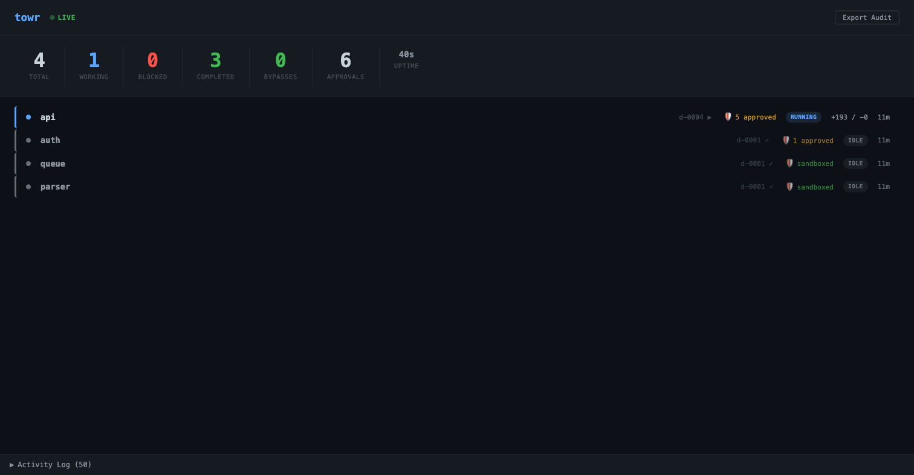

# towr

Your agents write the code. towr lands it safely — and cheaply.

```
$ towr run sprint.yaml

Plan: PROJ sprint 24 (6 tasks)

  Task                 Model    Reason                       Est. Cost
  ──────────────────────────────────────────────────────────────────────
  auth-middleware       opus     policy:infrastructure/**     ~$2.40
  api-endpoints         sonnet   heuristic:standard           ~$0.48
  unit-tests            haiku    heuristic:simple             ~$0.04
  integration-tests     sonnet   heuristic:standard           ~$0.48
  update-docs           haiku    heuristic:simple             ~$0.04
  fix-flaky-test        haiku    heuristic:simple             ~$0.04

  Estimated:  ~$3.48
  All-opus:   ~$14.40
  Savings:    ~76%

Proceed? [Y/n]
```

This run cost $3.48. Opus-for-everything would have cost $14.40. **towr saved you $10.92.**

Engineering teams adopting AI coding agents are spending $500K+/year on model API costs — and most of that spend is Opus-tier when the majority of tasks (tests, docs, routine implementation) succeed fine on Sonnet or Haiku. Smart routing alone can cut that bill by 40-70%, saving $200K-$350K annually per team. At enterprise scale with multiple teams, that's seven figures back in the budget.

towr is the governance layer between your AI agents and your main branch. It routes tasks to the cheapest model likely to succeed, validates every merge with hooks and tests, audits every action, and shows you what you saved. Nothing lands without validation. Nothing spends without visibility.

towr works with **any agent runtime** — Claude Code, Cursor, Codex, Aider, or anything that runs in a terminal. Mix them per task in the same plan. Each agent gets its own sandboxed worktree; towr handles the isolation, merging, and audit trail regardless of which tool wrote the code.

```yaml
tasks:
  - id: backend
    prompt: "Implement the API layer"
    agent: claude-code           # default
  - id: frontend
    prompt: "Build the settings UI"
    agent: cursor                # Cursor CLI
  - id: data-migration
    prompt: "Write the DB migration"
    agent: codex                 # Codex CLI
settings:
  default_agent: claude-code     # tasks without agent: use this
```

## Why model providers won't build this

Anthropic and OpenAI are great at building agents that get work done — Agent Teams, Codex, operator frameworks that drive usage. That's their business: more tasks, more tokens, more spend.

A tool that routes your tasks to the *cheapest* model? That cuts their revenue. Every task towr sends to Haiku instead of Opus is money left on the table for the model provider. No vendor is going to ship a first-party feature that tells you "actually, you don't need our most expensive product for this."

This is a structural incentive problem, not a capability gap. The providers will keep building better agents, faster execution, more parallel workers — all of which *increase* token consumption. The cost optimization layer has to come from somewhere else.

towr sits in that gap: vendor-neutral, runtime-agnostic, aligned with the customer's budget instead of the provider's revenue model.

## Three pillars

### 1. Smart router — the brain

towr analyzes each task and routes it to the cheapest model that can handle it. You don't annotate `model: sonnet` on every task — the system figures it out.

**Routing precedence** (first match wins):
1. Explicit `model:` on the task — always respected, no escalation
2. Policy rules (`settings.routing.rules`) — path globs, keyword matching
3. `settings.default_model`
4. Heuristic analysis — word count, file references, architecture keywords

**Heuristics:**
- Short prompt, single file, no complexity signals → **haiku** (~$0.04/task)
- Standard implementation, ≤ 3 files → **sonnet** (~$0.48/task)
- System design, 5+ files, architecture keywords → **opus** (~$2.40/task)

**Escalation on failure:** haiku → sonnet → opus. If a cheap model fails, towr retries with the next tier up. Failure is cheap information.

**Policy rules** let teams enforce routing decisions:

```yaml
settings:
  routing:
    rules:
      - match: { path: "infrastructure/**" }
        model: opus          # infra always gets opus
      - match: { keywords: ["migration", "schema"] }
        model: sonnet        # DB work gets at least sonnet
  budget: 10.00              # hard cap — stop spawning after $10
```

### 2. Merge pipeline — the trust anchor

`towr land` is not `git merge`. It's a validated pipeline:

1. **Check status** — workspace health, branch state
2. **Run pre-land hooks** — tests, lints, whatever you configure. Fail = merge blocked. Nothing lands dirty.
3. **Rebase onto base** — fast-forward onto latest. Conflicts = blocked with details.
4. **Merge** — rebase-ff, squash, ff-only, or merge commit
5. **Post-land hooks** — notifications, deploys. Non-blocking.
6. **Clean up** — remove worktree, delete branch, archive workspace

If anything fails, the workspace stays intact. Nothing is silently lost.

```bash
$ towr land auth
Landed workspace auth
  Strategy:     rebase-ff
  Merge commit: a1b2c3d
  Files:        8 changed
  Hooks:        pre_land passed (2.3s)
  Cleanup:      worktree removed, branch deleted

$ towr land auth billing tests --chain   # land sequentially
$ towr land auth --pr                    # push + create PR instead
$ towr land auth --dry-run               # preview without executing
$ towr land auth --force --reason "hotfix"  # bypass with audit trail
```

Protected branches (`main`, `master`, `develop`, `release/*`) block local merge by default — agents create PRs, humans merge.

### 3. Cost intelligence — the sale

Every run shows what you spent and what you saved:

```
Run complete: 6/6 tasks succeeded (18m30s)

  Task                 Model    Tokens (in/out)    Cost      Saved
  ──────────────────────────────────────────────────────────────────────
  auth-middleware       opus     12,450 / 38,200    $3.80     —
  api-endpoints         sonnet   8,200 / 21,100     $0.34     $2.98
  unit-tests            haiku    4,100 / 12,800     $0.02     $3.78
  integration-tests     sonnet   6,300 / 18,900     $0.30     $2.84
  update-docs           haiku    3,200 / 8,400      $0.01     $3.79
  fix-flaky-test        haiku    2,800 / 7,100      $0.01     $3.79

  Total:      $4.48
  All-opus:   $21.66
  Saved:      $17.18 (79%)
```

Token usage is parsed from Claude's JSONL session logs when available, or estimated from prompt length for other runtimes. Budget caps (`--budget $10`) stop new tasks when spend exceeds the limit.

**The math at scale:** A team running 20 agent tasks/day at an average Opus cost of ~$2.40/task spends ~$17.5K/month. Smart routing shifts 70% of those tasks to Sonnet or Haiku, dropping the average to ~$0.60/task — saving over $150K/year. Multiply by the number of teams in your org.

## Safety model

Agents work in sandboxed git worktrees. They can't touch main, other workspaces, or files outside their branch.

| Layer | What it does |
|---|---|
| **Workspace isolation** | Each agent gets its own git worktree — changes are on a branch, never on main |
| **Sandbox per runtime** | Claude: scoped allowlist. Cursor: sandbox mode. Codex: `workspace-write`. Each runtime's native safety model is enforced. |
| **Pre-land hooks** | Tests run before any merge. Fail = blocked. Nothing lands dirty. |
| **Protected branches** | Agents create PRs, humans merge. No direct push to main. |
| **Approval visibility** | Every auto-approval logged in the activity feed with what was approved and when |
| **Bypass auditing** | `--force` requires `--reason`, flagged `[BYPASS]` in the audit log |
| **Compliance export** | `towr audit --since 7d --csv` for SOC2/SOX review |

Every dispatch, approval, completion, and failure is recorded in an immutable event store. `towr audit --since 24h` exports the trail. `towr log <id>` shows per-workspace history.

## How it works

```yaml
# sprint.yaml
name: "PROJ sprint 24"
tasks:
  - id: auth-middleware
    prompt: "Implement JWT middleware in internal/auth/"
  - id: api-endpoints
    prompt: "Add CRUD endpoints for the user resource"
    agent: cursor                # use Cursor for this task
  - id: unit-tests
    prompt: "Write unit tests for internal/auth/"
    depends_on: [auth-middleware]
  - id: integration
    prompt: "Run go test ./... and fix failures"
    depends_on: [auth-middleware, api-endpoints, unit-tests]
settings:
  default_agent: claude-code
  auto_approve: true
  create_pr: true
  budget: 10.00
  routing:
    rules:
      - match: { path: "internal/auth/**" }
        model: opus
```

```bash
$ towr run sprint.yaml
# routes each task to cheapest viable model
# spawns isolated workspaces, dispatches to agents
# auto-approves permission dialogs
# merges dependency branches into downstream tasks
# escalates model tier on failure (haiku → sonnet → opus)
# creates PRs on completion
# prints cost report at the end
```

One command. PRs in the morning, cost report attached.

### Dependency handling

When a task's dependencies complete, towr:
- **Merges dependency branches** into the dependent workspace so the agent has upstream code
- **Auto-commits** any uncommitted files when a task finishes
- **Escalates model tier** on failure before exhausting retries
- **Creates PRs** when tasks complete (if `create_pr: true`)

### PR monitoring

With `react_to_reviews: true`, `towr run` monitors PRs after tasks complete:

```
[19:35:00] ✗ PR #42 (towr/auth): CI failed — dispatching fix
[19:38:00] ✓ auth: completed (CI fix pushed)
[19:40:00] 💬 PR #42 (towr/auth): changes requested — dispatching fix
[19:43:00] ✓ auth: completed (review fixes pushed)
[19:45:00] ✓ PR #42 (towr/auth): approved + CI passing — ready to merge
```

## Install

### Homebrew (macOS and Linux)

```bash
brew tap brianaffirm/tap
brew install towr
```

### From source

```bash
git clone https://github.com/brianaffirm/towr.git
cd towr && go install ./cmd/towr/
```

Requires Go 1.21+ and git. tmux is optional (enables terminal management).

## Quick start

```bash
cd ~/my-project

# Run a plan (the primary workflow)
towr run plan.yaml                    # route, spawn, dispatch, approve, PR
towr run plan.yaml --budget 5         # with spend cap
towr run plan.yaml --quiet            # skip routing summary

# Or work with individual workspaces
towr spawn "add auth" --id auth       # create isolated workspace
towr adopt feature/login              # adopt existing branch
towr ls                               # status dashboard
towr diff auth                        # review changes
towr land auth                        # validated merge
towr land auth --pr                   # push + create PR
towr land auth billing --chain        # land sequentially
towr cleanup auth                     # remove workspace
towr doctor                           # diagnose orphaned state
```

## Web dashboard

`towr web` starts a browser dashboard with live workspace status, safety shields, and an activity feed.

```bash
towr web                    # http://127.0.0.1:8090
```



Features:
- **Score cards** — total, working, blocked, completed, bypasses, approvals at a glance
- **Safety shields** — green (sandboxed), yellow (N approved), red (bypass) per workspace
- **Activity feed** — grouped approvals, color-coded events, bypass highlighting
- **Export Audit** — one-click CSV download
- **Auto-refresh** every 4s, dark theme, zero external dependencies

API: `/api/workspaces`, `/api/events`, `/api/audit/export?format=csv&since=168h`, `/api/stream/<id>` (SSE).

## Configuration

Global: `~/.towr/global-config.toml`. Per-repo: `.towr.toml` in repo root.

```toml
[defaults]
base_branch = "main"
merge_strategy = "rebase-ff"   # rebase-ff | squash | ff-only | merge

[hooks]
post_create = "cd ${WORKTREE_PATH} && npm install"
pre_land = "cd ${WORKTREE_PATH} && npm test"

[landing]
protected_branches = ["main", "master", "develop", "release/*"]

[workspace]
copy_paths = [".env.local"]
link_paths = ["node_modules"]

[cleanup]
stale_threshold = "7d"
```

Pre-land hooks block the merge if they fail. Post-land hooks are non-blocking.

## Commands

| Command | Description |
|---------|-------------|
| `towr run <plan.yaml>` | Route, spawn, dispatch, approve, PR, monitor — all in one |
| `towr land <id>` | Validated merge: hooks → rebase → merge → cleanup |
| `towr land <id> --pr` | Push + create PR |
| `towr land <ids...> --chain` | Land multiple workspaces sequentially |
| `towr spawn [task]` | Create workspace (branch + worktree) |
| `towr adopt [branch]` | Adopt existing branch as towr workspace |
| `towr ls` | List workspaces with status, diff stats, agent info |
| `towr diff <id>` | Show changes against base |
| `towr log <id>` | Workspace event history |
| `towr audit --since 24h` | Export audit trail |
| `towr overlap` | Detect file overlaps between workspaces |
| `towr doctor` | Diagnose orphaned worktrees, missing branches |
| `towr cleanup <id>` | Remove workspace |
| `towr web` | Browser dashboard with live status and audit feed |

All commands support `--json` for scripting.

## Architecture

State lives in `~/.towr/`, not in your repo.

```
~/.towr/
  repos/<hash>/
    state.db        SQLite — workspace records + event-sourced state
    audit.jsonl     Append-only audit trail
    config.toml     Per-repo config
  worktrees/<repo>/
    auth/           Git worktree for "auth" workspace
    billing/        Git worktree for "billing" workspace
```

Single Go binary. No daemon. No external dependencies beyond git.

## Requirements

- **git** 2.15+
- **tmux** (optional) — enables `towr open`, `towr preview`, TUI session switching

## License

MIT
